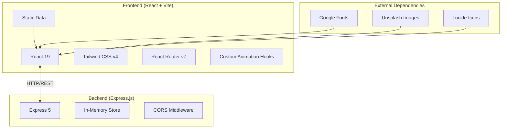
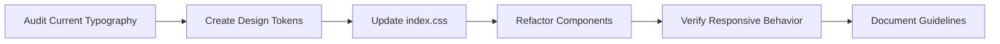
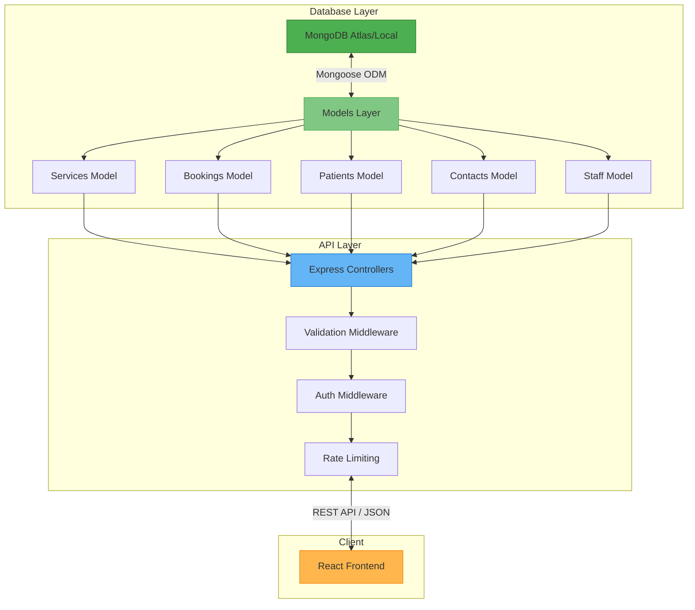
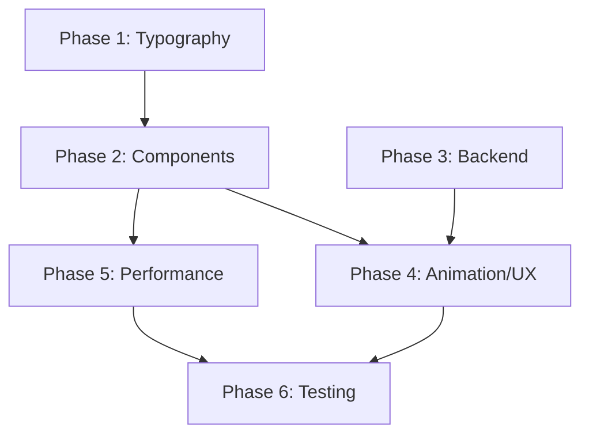

# AAYNA Clinic - Comprehensive Improvement Plan

## Executive Summary

This document outlines a strategic, phased approach to modernizing the AAYNA Clinic web application. The plan addresses architectural inefficiencies, technical debt, and UI/UX improvements with a focus on implementing modern typography standards and sustainable code practices.

---

## Current State Analysis

### Architecture Overview



### Critical Issues Identified

#### 1. Typography System Debt
| Issue | Impact | Severity |
|-------|--------|----------|
| Inconsistent font sizing (rem, px, arbitrary values) | Poor visual hierarchy | High |
| No established type scale | Maintenance burden | High |
| Mixed line-height values (1.2, 1.65, 1.75, 1.85) | Inconsistent readability | Medium |
| Hardcoded inline styles throughout components | Code duplication | High |
| No responsive typography strategy | Poor mobile experience | Medium |
| Missing font-display strategy | Flash of invisible text | Medium |

#### 2. Technical Debt
| Issue | Impact | Severity |
|-------|--------|----------|
| Extensive inline styles (`style={{}}`) | Poor maintainability | High |
| No TypeScript | No type safety | Medium |
| No component library | Inconsistent UI | Medium |
| No form validation library | Manual validation overhead | Medium |
| No error boundaries | App crash vulnerability | High |
| Missing loading states | Poor UX | Medium |
| No testing infrastructure | Regression risk | High |

#### 3. Backend Limitations
| Issue | Impact | Severity |
|-------|--------|----------|
| In-memory data storage | Data loss on restart | Critical |
| No input validation | Security vulnerabilities | Critical |
| No authentication/authorization | Open endpoints | High |
| No rate limiting | DDoS vulnerability | High |
| Missing database integration | No persistence | Critical |

---

## Phase 1: Foundation & Typography System (Weeks 1-2)

### 1.1 Modern Typography Architecture

#### Type Scale Design

```css
/* Recommended Modern Type Scale (1.25 Major Third) */
:root {
  /* Font Families */
  --font-display: 'Cormorant Garamond', Georgia, serif;
  --font-body: 'Inter', system-ui, -apple-system, sans-serif;
  
  /* Type Scale - Using 1.25 Major Third ratio */
  --text-xs: clamp(0.64rem, 0.05vw + 0.63rem, 0.68rem);    /* 10-11px */
  --text-sm: clamp(0.8rem, 0.17vw + 0.76rem, 0.94rem);     /* 13-15px */
  --text-base: clamp(0.875rem, 0.21vw + 0.83rem, 1rem);    /* 14-16px */
  --text-md: clamp(1rem, 0.29vw + 0.93rem, 1.188rem);      /* 16-19px */
  --text-lg: clamp(1.125rem, 0.38vw + 1.03rem, 1.375rem);  /* 18-22px */
  --text-xl: clamp(1.25rem, 0.49vw + 1.13rem, 1.625rem);   /* 20-26px */
  --text-2xl: clamp(1.5rem, 0.74vw + 1.32rem, 2rem);       /* 24-32px */
  --text-3xl: clamp(1.75rem, 1.06vw + 1.49rem, 2.5rem);    /* 28-40px */
  --text-4xl: clamp(2rem, 1.46vw + 1.64rem, 3rem);         /* 32-48px */
  --text-5xl: clamp(2.5rem, 2.06vw + 1.99rem, 4rem);       /* 40-64px */
  --text-6xl: clamp(3rem, 2.86vw + 2.29rem, 5rem);         /* 48-80px */
  
  /* Line Heights */
  --leading-tight: 1.2;    /* Headlines */
  --leading-snug: 1.35;    /* Subheadings */
  --leading-normal: 1.6;   /* Body text */
  --leading-relaxed: 1.75; /* Long-form content */
  
  /* Letter Spacing */
  --tracking-tight: -0.02em;
  --tracking-normal: 0;
  --tracking-wide: 0.05em;
  --tracking-wider: 0.1em;
  --tracking-widest: 0.15em;
  
  /* Font Weights */
  --font-light: 300;
  --font-normal: 400;
  --font-medium: 500;
  --font-semibold: 600;
  --font-bold: 700;
}
```

#### Typography Tokens Mapping

| Element | Font | Size | Weight | Line Height | Letter Spacing |
|---------|------|------|--------|-------------|----------------|
| H1 (Hero) | Display | text-5xl/text-6xl | 500 | tight | tight |
| H2 (Section) | Display | text-3xl/text-4xl | 500 | tight | tight |
| H3 (Card Title) | Display | text-xl/text-2xl | 500 | snug | normal |
| H4 (Subtitle) | Display | text-lg/text-xl | 500 | snug | normal |
| Body Large | Body | text-md/text-lg | 400 | normal | normal |
| Body | Body | text-base | 400 | normal | normal |
| Body Small | Body | text-sm | 400 | relaxed | normal |
| Caption | Body | text-xs | 500 | normal | wider |
| Button | Body | text-xs/text-sm | 600 | normal | widest |
| Nav Link | Body | text-sm | 500 | normal | wide |

### 1.2 Implementation Tasks



#### Action Items:
1. **Typography Audit**
   - [ ] Catalog all font-size declarations across codebase (search for fontSize, text-*, text-[*] patterns)
   - [ ] Identify inline style patterns with `style={{}}` containing font properties
   - [ ] Document current font-family usage and inconsistencies
   - [ ] Map letter-spacing, line-height, and font-weight inconsistencies

2. **Design Tokens Creation**
   - [ ] Create `src/styles/tokens/typography.css` with fluid type scale
   - [ ] Define CSS custom properties: --text-xs through --text-6xl using clamp()
   - [ ] Define line-height tokens: --leading-tight, --leading-snug, --leading-normal, --leading-relaxed
   - [ ] Define tracking tokens: --tracking-tight through --tracking-widest
   - [ ] Create utility class mappings in Tailwind config

3. **Fluid Type Scale Implementation**
   - [ ] Implement 1.25 Major Third ratio scale with clamp() functions
   - [ ] Update `index.css` with new type scale (10px to 80px range)
   - [ ] Add font-display: swap for performance optimization
   - [ ] Create responsive breakpoints for typography (mobile → tablet → desktop)
   - [ ] Test fluid scaling across viewport widths (320px to 2560px)

4. **Typography Components Development**
   - [ ] Create `Heading` component with level={1-6} and variant props (hero, section, card, subtitle)
   - [ ] Create `Text` component with size (xs/sm/base/md/lg) and color props
   - [ ] Create `Caption` component for labels and metadata
   - [ ] Create `Display` component for hero/large text
   - [ ] Add prop-types or JSDoc documentation for all components

5. **Component Refactoring**
   - [ ] Refactor Header.jsx - Replace all inline font styles with Typography components
   - [ ] Refactor Footer.jsx - Replace inline styles, implement consistent spacing
   - [ ] Refactor Home.jsx - Apply Typography components to all text elements
   - [ ] Refactor About.jsx, Treatments.jsx, Contact.jsx, BookAppointment.jsx
   - [ ] Create style guide documentation in `docs/typography.md`

### 1.3 Success Metrics
- Zero hardcoded font-size values in JSX files
- Consistent line-height usage (±0.05 variance)
- CLS (Cumulative Layout Shift) < 0.1
- Lighthouse font-display audit passes

---

## Phase 2: Component Architecture & UI System (Weeks 3-4)

### 2.1 Component Library Structure

```
frontend/src/
├── components/
│   ├── ui/                    # Design system components
│   │   ├── Button/
│   │   │   ├── Button.jsx
│   │   │   ├── Button.test.jsx
│   │   │   └── Button.module.css
│   │   ├── Typography/
│   │   │   ├── Heading.jsx
│   │   │   ├── Text.jsx
│   │   │   └── Caption.jsx
│   │   ├── Card/
│   │   ├── Input/
│   │   ├── Select/
│   │   ├── Modal/
│   │   └── index.js
│   ├── layout/
│   │   ├── Header/
│   │   ├── Footer/
│   │   ├── Container/
│   │   └── Section/
│   └── forms/
│       ├── BookingForm/
│       ├── ContactForm/
│       └── FormField/
```

### 2.2 Reusable Components

#### Typography Components
```jsx
// components/ui/Typography/Heading.jsx
export function Heading({ 
  level = 1, 
  variant = 'default',
  children, 
  className = '' 
}) {
  const Tag = `h${level}`;
  const variants = {
    default: 'text-5xl md:text-6xl font-display font-medium leading-tight tracking-tight',
    section: 'text-3xl md:text-4xl font-display font-medium leading-tight tracking-tight',
    card: 'text-xl md:text-2xl font-display font-medium leading-snug',
    subtitle: 'text-lg md:text-xl font-display font-medium leading-snug',
  };
  
  return (
    <Tag className={`${variants[variant]} ${className}`}>
      {children}
    </Tag>
  );
}

// components/ui/Typography/Text.jsx
export function Text({ 
  size = 'base', 
  weight = 'normal',
  color = 'default',
  children,
  className = ''
}) {
  const sizes = {
    xs: 'text-xs',
    sm: 'text-sm',
    base: 'text-base',
    md: 'text-md',
    lg: 'text-lg',
  };
  
  const colors = {
    default: 'text-text',
    muted: 'text-text-muted',
    light: 'text-text-light',
    white: 'text-white',
  };
  
  return (
    <p className={`${sizes[size]} font-${weight} ${colors[color]} ${className}`}>
      {children}
    </p>
  );
}
```

#### Button Component Variants
```jsx
// components/ui/Button/Button.jsx
const buttonVariants = {
  primary: 'bg-gold text-white border-gold hover:bg-gold-dark',
  secondary: 'bg-transparent text-dark border-dark hover:bg-gold hover:text-white',
  ghost: 'bg-transparent text-dark border-transparent hover:bg-cream',
  white: 'bg-white text-dark border-white hover:bg-cream',
};

const buttonSizes = {
  sm: 'px-4 py-2 text-xs',
  md: 'px-6 py-3 text-sm',
  lg: 'px-8 py-4 text-base',
};
```

### 2.3 Phase 2 Implementation Tasks

#### 2.3.1 UI Component Library Setup
- [ ] Create folder structure: `components/ui/`, `components/layout/`, `components/forms/`
- [ ] Setup component scaffolding with index.js barrel exports
- [ ] Implement `Button` component with variants: primary, secondary, ghost, white
- [ ] Implement `Button` sizes: sm, md, lg with loading state support
- [ ] Implement `Heading` component with level={1-6} and variant props
- [ ] Implement `Text` component with size, weight, color props
- [ ] Implement `Caption` component for metadata/labels
- [ ] Implement `Card` component with image, content, and action slots
- [ ] Implement `Input` component with label, error, and helper text
- [ ] Implement `Select` component with options and search
- [ ] Implement `TextArea` component for multiline input
- [ ] Setup Storybook for component documentation

#### 2.3.2 Layout Components
- [ ] Create `Container` component with max-width and padding variants
- [ ] Create `Section` wrapper with background color options (white, cream, dark)
- [ ] Create `Grid` component for responsive layouts
- [ ] Create `Stack` component for flexbox layouts
- [ ] Refactor `Header.jsx` into sub-components: TopBar, MainNav, MobileMenu, Logo
- [ ] Refactor `Footer.jsx` into sub-components: CTABanner, MainFooter, BottomBar
- [ ] Create `PageHeader` component for page titles with breadcrumbs

#### 2.3.3 Form Components & Validation
- [ ] Create `FormField` wrapper component with label, error, and hint
- [ ] Create `Form` component with react-hook-form integration
- [ ] Implement form validation schema using Zod
- [ ] Create `BookingForm` component with step wizard
- [ ] Create `ContactForm` component with validation
- [ ] Add form submission loading states with spinners
- [ ] Add form error states with inline validation messages
- [ ] Create `FormSuccess` component for submission confirmation

#### 2.3.4 Data Display Components
- [ ] Create `ServiceCard` component for treatment listings
- [ ] Create `LocationCard` component for clinic locations
- [ ] Create `StaffCard` component for doctor profiles
- [ ] Create `TestimonialCard` component for reviews
- [ ] Create `ConcernIcon` component for skin/hair concerns
- [ ] Create `PriceTag` component for displaying treatment prices
- [ ] Create `DurationBadge` component for treatment duration

### 2.4 Success Metrics
- 80% reduction in inline style usage
- Component reusability: each component used in 3+ places
- Zero duplicated button/card implementations
- 100% component prop documentation

---

## Phase 3: Backend Infrastructure - MongoDB & Express (Weeks 5-6)

### 3.1 Database Architecture Overview

#### Recommended Stack: MongoDB + Mongoose

MongoDB is ideal for AAYNA Clinic's document-based data with flexible schemas for treatments, bookings, and patient information.



### 3.2 MongoDB Schema Designs

#### Directory Structure
```
backend/
├── config/
│   └── database.js          # MongoDB connection configuration
├── models/
│   ├── Service.js           # Clinic services/treatments
│   ├── Booking.js           # Appointment bookings
│   ├── Patient.js           # Patient records
│   ├── Contact.js           # Contact form submissions
│   ├── Staff.js             # Doctors/staff members
│   ├── Location.js          # Clinic locations
│   └── index.js             # Model exports
├── controllers/
│   ├── serviceController.js
│   ├── bookingController.js
│   ├── patientController.js
│   ├── contactController.js
│   └── staffController.js
├── routes/
│   ├── services.js
│   ├── bookings.js
│   ├── patients.js
│   ├── contacts.js
│   └── staff.js
├── middleware/
│   ├── validation.js
│   ├── errorHandler.js
│   ├── rateLimiter.js
│   └── auth.js
├── utils/
│   ├── ApiError.js
│   ├── ApiResponse.js
│   └── asyncHandler.js
└── server.js
```

#### 3.2.1 Service Model (Treatments)
```javascript
// models/Service.js
import mongoose from 'mongoose';

const serviceSchema = new mongoose.Schema({
  title: {
    type: String,
    required: [true, 'Service title is required'],
    trim: true,
    maxlength: [200, 'Title cannot exceed 200 characters']
  },
  slug: {
    type: String,
    required: true,
    unique: true,
    lowercase: true,
    trim: true
  },
  category: {
    type: String,
    required: true,
    enum: {
      values: ['AAYNA Exclusive', 'New Launches', 'Skin', 'Hair', 'Facials', 'Laser', 'Anti-Aging'],
      message: 'Invalid category'
    }
  },
  shortDescription: {
    type: String,
    required: true,
    maxlength: [300, 'Short description cannot exceed 300 characters']
  },
  description: {
    type: String,
    required: true
  },
  duration: {
    type: String,
    required: true,
    trim: true
  },
  price: {
    type: String,
    required: true,
    trim: true
  },
  image: {
    type: String,
    required: true
  },
  gallery: [{
    type: String
  }],
  benefits: [{
    type: String,
    trim: true
  }],
  concerns: [{
    type: mongoose.Schema.Types.ObjectId,
    ref: 'Concern'
  }],
  isActive: {
    type: Boolean,
    default: true
  },
  featured: {
    type: Boolean,
    default: false
  },
  order: {
    type: Number,
    default: 0
  },
  metaTitle: {
    type: String,
    maxlength: [70, 'Meta title cannot exceed 70 characters']
  },
  metaDescription: {
    type: String,
    maxlength: [160, 'Meta description cannot exceed 160 characters']
  }
}, {
  timestamps: true,
  toJSON: { virtuals: true },
  toObject: { virtuals: true }
});

// Indexes for performance
serviceSchema.index({ slug: 1 });
serviceSchema.index({ category: 1, isActive: 1 });
serviceSchema.index({ featured: 1, order: 1 });

// Virtual populate for concerns
serviceSchema.virtual('relatedConcerns', {
  ref: 'Concern',
  localField: 'concerns',
  foreignField: '_id'
});

// Pre-save hook to generate slug
serviceSchema.pre('save', function(next) {
  if (!this.isModified('title')) return next();
  this.slug = this.title
    .toLowerCase()
    .replace(/[^a-z0-9]+/g, '-')
    .replace(/^-+|-+$/g, '');
  next();
});

export const Service = mongoose.model('Service', serviceSchema);
```

#### 3.2.2 Booking/Appointment Model
```javascript
// models/Booking.js
import mongoose from 'mongoose';

const bookingSchema = new mongoose.Schema({
  // Patient Information
  patient: {
    name: {
      type: String,
      required: [true, 'Patient name is required'],
      trim: true,
      maxlength: [100, 'Name cannot exceed 100 characters']
    },
    email: {
      type: String,
      required: [true, 'Email is required'],
      trim: true,
      lowercase: true,
      match: [/^\S+@\S+\.\S+$/, 'Please enter a valid email']
    },
    phone: {
      type: String,
      required: [true, 'Phone number is required'],
      match: [/^\+?[\d\s-]{10,}$/, 'Please enter a valid phone number']
    },
    dateOfBirth: {
      type: Date
    },
    gender: {
      type: String,
      enum: ['male', 'female', 'other', 'prefer-not-to-say']
    }
  },
  
  // Appointment Details
  service: {
    type: mongoose.Schema.Types.ObjectId,
    ref: 'Service',
    required: [true, 'Service is required']
  },
  location: {
    type: mongoose.Schema.Types.ObjectId,
    ref: 'Location',
    required: [true, 'Location is required']
  },
  preferredDoctor: {
    type: mongoose.Schema.Types.ObjectId,
    ref: 'Staff'
  },
  appointmentDate: {
    type: Date,
    required: [true, 'Appointment date is required'],
    validate: {
      validator: function(value) {
        return value >= new Date();
      },
      message: 'Appointment date cannot be in the past'
    }
  },
  appointmentTime: {
    type: String,
    required: [true, 'Appointment time is required'],
    match: [/^\d{2}:\d{2}$/, 'Time must be in HH:MM format']
  },
  
  // Booking Status Workflow
  status: {
    type: String,
    enum: ['pending', 'confirmed', 'in-progress', 'completed', 'cancelled', 'no-show'],
    default: 'pending'
  },
  statusHistory: [{
    status: {
      type: String,
      enum: ['pending', 'confirmed', 'in-progress', 'completed', 'cancelled', 'no-show']
    },
    changedAt: {
      type: Date,
      default: Date.now
    },
    changedBy: {
      type: String  // admin ID or 'system'
    },
    reason: String
  }],
  
  // Additional Information
  notes: {
    type: String,
    maxlength: [1000, 'Notes cannot exceed 1000 characters']
  },
  symptoms: [{
    type: String,
    trim: true
  }],
  previousVisits: {
    type: Boolean,
    default: false
  },
  
  // Communication Preferences
  communicationPreferences: {
    emailNotifications: {
      type: Boolean,
      default: true
    },
    smsNotifications: {
      type: Boolean,
      default: true
    },
    whatsappUpdates: {
      type: Boolean,
      default: false
    }
  },
  
  // Payment Information (if applicable)
  payment: {
    status: {
      type: String,
      enum: ['pending', 'paid', 'refunded', 'failed'],
      default: 'pending'
    },
    amount: Number,
    currency: {
      type: String,
      default: 'INR'
    },
    transactionId: String,
    paidAt: Date
  },
  
  // System Fields
  ipAddress: String,
  userAgent: String,
  source: {
    type: String,
    enum: ['website', 'mobile-app', 'phone', 'walk-in', 'referral'],
    default: 'website'
  },
  referralCode: String
}, {
  timestamps: true
});

// Compound indexes for common queries
bookingSchema.index({ 'patient.email': 1, createdAt: -1 });
bookingSchema.index({ appointmentDate: 1, appointmentTime: 1 });
bookingSchema.index({ status: 1, appointmentDate: 1 });
bookingSchema.index({ location: 1, appointmentDate: 1 });
bookingSchema.index({ service: 1, status: 1 });

// Virtual for appointment datetime
bookingSchema.virtual('appointmentDateTime').get(function() {
  if (!this.appointmentDate || !this.appointmentTime) return null;
  const [hours, minutes] = this.appointmentTime.split(':');
  const dateTime = new Date(this.appointmentDate);
  dateTime.setHours(parseInt(hours), parseInt(minutes));
  return dateTime;
});

// Static method to check availability
bookingSchema.statics.checkAvailability = async function(locationId, date, time) {
  const existing = await this.findOne({
    location: locationId,
    appointmentDate: date,
    appointmentTime: time,
    status: { $nin: ['cancelled', 'no-show'] }
  });
  return !existing;
};

// Pre-save middleware to add status history
bookingSchema.pre('save', function(next) {
  if (this.isNew || this.isModified('status')) {
    this.statusHistory.push({
      status: this.status,
      changedAt: new Date(),
      changedBy: this._changedBy || 'system'
    });
  }
  next();
});

export const Booking = mongoose.model('Booking', bookingSchema);
```

#### 3.2.3 Patient Model
```javascript
// models/Patient.js
import mongoose from 'mongoose';

const patientSchema = new mongoose.Schema({
  // Personal Information
  profile: {
    firstName: {
      type: String,
      required: true,
      trim: true
    },
    lastName: {
      type: String,
      trim: true
    },
    dateOfBirth: Date,
    gender: {
      type: String,
      enum: ['male', 'female', 'other', 'prefer-not-to-say']
    },
    bloodGroup: {
      type: String,
      enum: ['A+', 'A-', 'B+', 'B-', 'AB+', 'AB-', 'O+', 'O-', 'unknown']
    }
  },
  
  // Contact Information
  contact: {
    email: {
      type: String,
      required: true,
      unique: true,
      lowercase: true,
      trim: true
    },
    phone: {
      primary: {
        type: String,
        required: true
      },
      secondary: String
    },
    address: {
      street: String,
      city: String,
      state: String,
      zipCode: String,
      country: {
        type: String,
        default: 'India'
      }
    }
  },
  
  // Medical History
  medicalHistory: {
    allergies: [{
      allergen: String,
      severity: {
        type: String,
        enum: ['mild', 'moderate', 'severe']
      },
      notes: String
    }],
    conditions: [{
      condition: String,
      diagnosedDate: Date,
      status: {
        type: String,
        enum: ['active', 'managed', 'resolved']
      }
    }],
    medications: [{
      name: String,
      dosage: String,
      frequency: String,
      prescribedBy: String
    }],
    previousSurgeries: [{
      procedure: String,
      date: Date,
      hospital: String
    }]
  },
  
  // Skin/Hair Concerns
  concerns: [{
    type: mongoose.Schema.Types.ObjectId,
    ref: 'Concern'
  }],
  
  // Treatment History
  treatments: [{
    service: {
      type: mongoose.Schema.Types.ObjectId,
      ref: 'Service'
    },
    sessions: [{
      date: Date,
      doctor: {
        type: mongoose.Schema.Types.ObjectId,
        ref: 'Staff'
      },
      notes: String,
      outcome: {
        type: String,
        enum: ['excellent', 'good', 'fair', 'poor', 'ongoing']
      },
      beforePhotos: [String],
      afterPhotos: [String]
    }],
    overallSatisfaction: {
      type: Number,
      min: 1,
      max: 5
    }
  }],
  
  // Communication Preferences
  preferences: {
    language: {
      type: String,
      default: 'en',
      enum: ['en', 'hi', 'pa', 'ur']
    },
    contactMethod: {
      type: String,
      enum: ['email', 'sms', 'whatsapp', 'phone'],
      default: 'email'
    },
    marketingConsent: {
      type: Boolean,
      default: false
    }
  },
  
  // Account Status
  status: {
    type: String,
    enum: ['active', 'inactive', 'blocked'],
    default: 'active'
  },
  
  // Referral Tracking
  referredBy: {
    type: mongoose.Schema.Types.ObjectId,
    ref: 'Patient'
  },
  referralCode: {
    type: String,
    unique: true
  }
}, {
  timestamps: true
});

// Virtual for full name
patientSchema.virtual('fullName').get(function() {
  return `${this.profile.firstName} ${this.profile.lastName || ''}`.trim();
});

// Index for search
patientSchema.index({ 'profile.firstName': 'text', 'profile.lastName': 'text', 'contact.email': 'text' });
patientSchema.index({ 'contact.email': 1 });
patientSchema.index({ 'contact.phone.primary': 1 });

export const Patient = mongoose.model('Patient', patientSchema);
```

#### 3.2.4 Additional Models

```javascript
// models/Concern.js
import mongoose from 'mongoose';

const concernSchema = new mongoose.Schema({
  name: {
    type: String,
    required: true,
    trim: true
  },
  slug: {
    type: String,
    required: true,
    unique: true,
    lowercase: true
  },
  icon: String,
  shortDescription: {
    type: String,
    maxlength: 200
  },
  description: String,
  image: String,
  relatedServices: [{
    type: mongoose.Schema.Types.ObjectId,
    ref: 'Service'
  }],
  symptoms: [String],
  isActive: {
    type: Boolean,
    default: true
  }
}, { timestamps: true });

concernSchema.index({ slug: 1 });
export const Concern = mongoose.model('Concern', concernSchema);

// models/Location.js
import mongoose from 'mongoose';

const locationSchema = new mongoose.Schema({
  name: {
    type: String,
    required: true,
    trim: true
  },
  slug: {
    type: String,
    required: true,
    unique: true,
    lowercase: true
  },
  address: {
    street: { type: String, required: true },
    city: { type: String, required: true },
    state: { type: String, required: true },
    zipCode: String,
    coordinates: {
      lat: Number,
      lng: Number
    }
  },
  contact: {
    phone: { type: String, required: true },
    email: String,
    whatsapp: String
  },
  hours: {
    monday: { open: String, close: String },
    tuesday: { open: String, close: String },
    wednesday: { open: String, close: String },
    thursday: { open: String, close: String },
    friday: { open: String, close: String },
    saturday: { open: String, close: String },
    sunday: { open: String, close: String, isClosed: { type: Boolean, default: true } }
  },
  image: String,
  gallery: [String],
  facilities: [String],
  isActive: {
    type: Boolean,
    default: true
  },
  order: {
    type: Number,
    default: 0
  }
}, { timestamps: true });

locationSchema.index({ slug: 1 });
export const Location = mongoose.model('Location', locationSchema);

// models/Staff.js
import mongoose from 'mongoose';

const staffSchema = new mongoose.Schema({
  name: {
    type: String,
    required: true,
    trim: true
  },
  slug: {
    type: String,
    required: true,
    unique: true,
    lowercase: true
  },
  role: {
    type: String,
    required: true,
    enum: ['founder', 'dermatologist', 'aesthetician', 'therapist', 'nurse', 'admin']
  },
  title: String,
  qualifications: [String],
  bio: String,
  specialties: [String],
  image: String,
  email: String,
  phone: String,
  schedule: {
    locations: [{
      location: {
        type: mongoose.Schema.Types.ObjectId,
        ref: 'Location'
      },
      days: [{
        type: String,
        enum: ['monday', 'tuesday', 'wednesday', 'thursday', 'friday', 'saturday', 'sunday']
      }]
    }]
  },
  isActive: {
    type: Boolean,
    default: true
  },
  displayOrder: {
    type: Number,
    default: 0
  }
}, { timestamps: true });

export const Staff = mongoose.model('Staff', staffSchema);

// models/Contact.js
import mongoose from 'mongoose';

const contactSchema = new mongoose.Schema({
  name: {
    type: String,
    required: true,
    trim: true
  },
  email: {
    type: String,
    required: true,
    lowercase: true,
    trim: true
  },
  phone: String,
  subject: {
    type: String,
    required: true
  },
  message: {
    type: String,
    required: true,
    maxlength: [2000, 'Message cannot exceed 2000 characters']
  },
  status: {
    type: String,
    enum: ['new', 'in-progress', 'resolved', 'spam'],
    default: 'new'
  },
  priority: {
    type: String,
    enum: ['low', 'medium', 'high', 'urgent'],
    default: 'medium'
  },
  assignedTo: String,
  notes: String,
  ipAddress: String,
  userAgent: String
}, { timestamps: true });

contactSchema.index({ status: 1, createdAt: -1 });
contactSchema.index({ email: 1 });
export const Contact = mongoose.model('Contact', contactSchema);
```

### 3.3 RESTful API Architecture

#### 3.3.1 API Structure
```
/api/v1/
├── /services
│   ├── GET    /              # List all services (with filters)
│   ├── GET    /:slug         # Get single service
│   ├── GET    /category/:cat # Get by category
│   ├── POST   /              # Create service (admin)
│   ├── PUT    /:slug         # Update service (admin)
│   └── DELETE /:slug         # Delete service (admin)
│
├── /bookings
│   ├── GET    /              # Get all bookings (admin)
│   ├── GET    /:id           # Get single booking
│   ├── GET    /my-bookings   # Get patient's bookings
│   ├── POST   /              # Create booking
│   ├── PUT    /:id/status    # Update booking status
│   ├── PUT    /:id           # Update booking
│   └── DELETE /:id           # Cancel booking
│
├── /patients
│   ├── GET    /profile       # Get patient profile
│   ├── PUT    /profile       # Update profile
│   ├── GET    /history       # Get treatment history
│   └── GET    /bookings      # Get patient bookings
│
├── /concerns
│   ├── GET    /              # List all concerns
│   ├── GET    /:slug         # Get single concern
│   └── GET    /:slug/services # Get services for concern
│
├── /locations
│   ├── GET    /              # List all locations
│   ├── GET    /:slug         # Get single location
│   └── GET    /:slug/availability # Get available slots
│
├── /staff
│   ├── GET    /              # List all staff
│   ├── GET    /:slug         # Get single staff member
│   └── GET    /doctors       # List only doctors
│
└── /contact
    └── POST   /              # Submit contact form
```

#### 3.3.2 Controllers Implementation

```javascript
// controllers/bookingController.js
import { Booking } from '../models/Booking.js';
import { Service } from '../models/Service.js';
import { Location } from '../models/Location.js';
import { ApiError } from '../utils/ApiError.js';
import { ApiResponse } from '../utils/ApiResponse.js';
import { asyncHandler } from '../utils/asyncHandler.js';

export const bookingController = {
  // Create new booking
  createBooking: asyncHandler(async (req, res) => {
    const {
      patientName,
      email,
      phone,
      serviceId,
      locationId,
      appointmentDate,
      appointmentTime,
      notes,
      preferredDoctor
    } = req.body;

    // Validate service exists
    const service = await Service.findById(serviceId);
    if (!service) {
      throw new ApiError(404, 'Service not found');
    }

    // Validate location exists
    const location = await Location.findById(locationId);
    if (!location) {
      throw new ApiError(404, 'Location not found');
    }

    // Check availability
    const isAvailable = await Booking.checkAvailability(
      locationId,
      appointmentDate,
      appointmentTime
    );

    if (!isAvailable) {
      throw new ApiError(409, 'Selected time slot is no longer available');
    }

    // Create booking
    const booking = await Booking.create({
      patient: {
        name: patientName,
        email,
        phone
      },
      service: serviceId,
      location: locationId,
      preferredDoctor,
      appointmentDate,
      appointmentTime,
      notes,
      ipAddress: req.ip,
      userAgent: req.headers['user-agent']
    });

    // Populate references for response
    const populatedBooking = await Booking.findById(booking._id)
      .populate('service', 'title slug price duration')
      .populate('location', 'name address phone');

    return res.status(201).json(
      new ApiResponse(201, populatedBooking, 'Booking created successfully')
    );
  }),

  // Get all bookings (admin)
  getAllBookings: asyncHandler(async (req, res) => {
    const {
      page = 1,
      limit = 10,
      status,
      location,
      date,
      search
    } = req.query;

    const query = {};
    
    if (status) query.status = status;
    if (location) query.location = location;
    if (date) {
      const startDate = new Date(date);
      const endDate = new Date(date);
      endDate.setDate(endDate.getDate() + 1);
      query.appointmentDate = { $gte: startDate, $lt: endDate };
    }
    if (search) {
      query.$or = [
        { 'patient.name': { $regex: search, $options: 'i' } },
        { 'patient.email': { $regex: search, $options: 'i' } },
        { 'patient.phone': { $regex: search, $options: 'i' } }
      ];
    }

    const bookings = await Booking.find(query)
      .populate('service', 'title slug')
      .populate('location', 'name')
      .populate('preferredDoctor', 'name')
      .sort({ appointmentDate: 1, appointmentTime: 1 })
      .skip((page - 1) * limit)
      .limit(parseInt(limit));

    const total = await Booking.countDocuments(query);

    return res.status(200).json(
      new ApiResponse(200, {
        bookings,
        pagination: {
          page: parseInt(page),
          limit: parseInt(limit),
          total,
          pages: Math.ceil(total / limit)
        }
      })
    );
  }),

  // Get single booking
  getBookingById: asyncHandler(async (req, res) => {
    const booking = await Booking.findById(req.params.id)
      .populate('service')
      .populate('location')
      .populate('preferredDoctor', 'name title image');

    if (!booking) {
      throw new ApiError(404, 'Booking not found');
    }

    return res.status(200).json(
      new ApiResponse(200, booking)
    );
  }),

  // Update booking status
  updateStatus: asyncHandler(async (req, res) => {
    const { status, reason } = req.body;
    const bookingId = req.params.id;

    const booking = await Booking.findById(bookingId);
    if (!booking) {
      throw new ApiError(404, 'Booking not found');
    }

    booking.status = status;
    booking._changedBy = req.user?.id || 'admin';
    
    if (reason) {
      booking.statusHistory[booking.statusHistory.length - 1].reason = reason;
    }

    await booking.save();

    return res.status(200).json(
      new ApiResponse(200, booking, `Booking status updated to ${status}`)
    );
  }),

  // Cancel booking
  cancelBooking: asyncHandler(async (req, res) => {
    const booking = await Booking.findById(req.params.id);
    
    if (!booking) {
      throw new ApiError(404, 'Booking not found');
    }

    if (booking.status === 'completed') {
      throw new ApiError(400, 'Cannot cancel completed appointment');
    }

    booking.status = 'cancelled';
    booking._changedBy = req.user?.id || 'patient';
    booking.statusHistory[booking.statusHistory.length - 1].reason = req.body.reason || 'Cancelled by patient';

    await booking.save();

    return res.status(200).json(
      new ApiResponse(200, booking, 'Booking cancelled successfully')
    );
  }),

  // Get available time slots
  getAvailableSlots: asyncHandler(async (req, res) => {
    const { locationId, date, serviceId } = req.query;

    if (!locationId || !date) {
      throw new ApiError(400, 'Location and date are required');
    }

    // Define business hours (10 AM - 7 PM)
    const timeSlots = [
      '10:00', '10:30', '11:00', '11:30',
      '12:00', '12:30', '14:00', '14:30',
      '15:00', '15:30', '16:00', '16:30',
      '17:00', '17:30', '18:00', '18:30'
    ];

    // Get booked slots
    const bookedSlots = await Booking.find({
      location: locationId,
      appointmentDate: new Date(date),
      status: { $nin: ['cancelled', 'no-show'] }
    }).select('appointmentTime');

    const bookedTimes = bookedSlots.map(b => b.appointmentTime);
    const availableSlots = timeSlots.filter(time => !bookedTimes.includes(time));

    return res.status(200).json(
      new ApiResponse(200, {
        date,
        location: locationId,
        availableSlots,
        bookedSlots: bookedTimes
      })
    );
  })
};

// controllers/serviceController.js
export const serviceController = {
  // Get all services with filtering
  getAllServices: asyncHandler(async (req, res) => {
    const { category, featured, search, page = 1, limit = 20 } = req.query;

    const query = { isActive: true };
    
    if (category && category !== 'all') {
      query.category = category;
    }
    
    if (featured === 'true') {
      query.featured = true;
    }
    
    if (search) {
      query.$or = [
        { title: { $regex: search, $options: 'i' } },
        { shortDescription: { $regex: search, $options: 'i' } }
      ];
    }

    const services = await Service.find(query)
      .sort({ featured: -1, order: 1, createdAt: -1 })
      .skip((page - 1) * limit)
      .limit(parseInt(limit));

    const total = await Service.countDocuments(query);

    return res.status(200).json(
      new ApiResponse(200, {
        services,
        pagination: {
          page: parseInt(page),
          limit: parseInt(limit),
          total,
          pages: Math.ceil(total / limit)
        }
      })
    );
  }),

  // Get service by slug
  getServiceBySlug: asyncHandler(async (req, res) => {
    const service = await Service.findOne({ 
      slug: req.params.slug,
      isActive: true 
    }).populate('concerns', 'name slug icon');

    if (!service) {
      throw new ApiError(404, 'Service not found');
    }

    // Get related services
    const relatedServices = await Service.find({
      category: service.category,
      _id: { $ne: service._id },
      isActive: true
    }).limit(3).select('title slug price duration image shortDescription');

    return res.status(200).json(
      new ApiResponse(200, {
        service,
        relatedServices
      })
    );
  }),

  // Get services by category
  getByCategory: asyncHandler(async (req, res) => {
    const { category } = req.params;
    
    const services = await Service.find({
      category,
      isActive: true
    }).sort({ order: 1 });

    return res.status(200).json(
      new ApiResponse(200, services)
    );
  })
};
```

#### 3.3.3 Utility Classes

```javascript
// utils/ApiError.js
export class ApiError extends Error {
  constructor(statusCode, message, errors = [], stack = '') {
    super(message);
    this.statusCode = statusCode;
    this.errors = errors;
    this.success = false;
    
    if (stack) {
      this.stack = stack;
    } else {
      Error.captureStackTrace(this, this.constructor);
    }
  }
}

// utils/ApiResponse.js
export class ApiResponse {
  constructor(statusCode, data, message = 'Success') {
    this.statusCode = statusCode;
    this.data = data;
    this.message = message;
    this.success = statusCode < 400;
  }
}

// utils/asyncHandler.js
export const asyncHandler = (fn) => {
  return (req, res, next) => {
    Promise.resolve(fn(req, res, next)).catch(next);
  };
};
```

### 3.4 Validation & Middleware

```javascript
// middleware/validation.js
import { body, param, validationResult } from 'express-validator';

export const validateBooking = [
  body('patientName')
    .trim()
    .isLength({ min: 2, max: 100 })
    .withMessage('Name must be between 2 and 100 characters'),
  
  body('email')
    .isEmail()
    .normalizeEmail()
    .withMessage('Please provide a valid email'),
  
  body('phone')
    .matches(/^\+?[\d\s-]{10,}$/)
    .withMessage('Please provide a valid phone number'),
  
  body('serviceId')
    .isMongoId()
    .withMessage('Invalid service ID'),
  
  body('locationId')
    .isMongoId()
    .withMessage('Invalid location ID'),
  
  body('appointmentDate')
    .isISO8601()
    .withMessage('Invalid date format')
    .custom((value) => {
      const date = new Date(value);
      if (date < new Date().setHours(0, 0, 0, 0)) {
        throw new Error('Appointment date cannot be in the past');
      }
      return true;
    }),
  
  body('appointmentTime')
    .matches(/^\d{2}:\d{2}$/)
    .withMessage('Time must be in HH:MM format'),
  
  body('notes')
    .optional()
    .trim()
    .isLength({ max: 1000 })
    .withMessage('Notes cannot exceed 1000 characters'),
  
  (req, res, next) => {
    const errors = validationResult(req);
    if (!errors.isEmpty()) {
      return res.status(400).json({
        success: false,
        message: 'Validation failed',
        errors: errors.array()
      });
    }
    next();
  }
];

export const validateContact = [
  body('name')
    .trim()
    .isLength({ min: 2, max: 100 })
    .withMessage('Name must be between 2 and 100 characters'),
  
  body('email')
    .isEmail()
    .normalizeEmail()
    .withMessage('Please provide a valid email'),
  
  body('subject')
    .trim()
    .isLength({ min: 2, max: 200 })
    .withMessage('Subject must be between 2 and 200 characters'),
  
  body('message')
    .trim()
    .isLength({ min: 10, max: 2000 })
    .withMessage('Message must be between 10 and 2000 characters'),
  
  (req, res, next) => {
    const errors = validationResult(req);
    if (!errors.isEmpty()) {
      return res.status(400).json({
        success: false,
        message: 'Validation failed',
        errors: errors.array()
      });
    }
    next();
  }
];

// middleware/errorHandler.js
import { ApiError } from '../utils/ApiError.js';

export const errorHandler = (err, req, res, next) => {
  console.error('Error:', err);

  if (err instanceof ApiError) {
    return res.status(err.statusCode).json({
      success: false,
      message: err.message,
      errors: err.errors
    });
  }

  // Mongoose validation error
  if (err.name === 'ValidationError') {
    const messages = Object.values(err.errors).map(val => val.message);
    return res.status(400).json({
      success: false,
      message: 'Validation Error',
      errors: messages
    });
  }

  // Mongoose duplicate key error
  if (err.code === 11000) {
    return res.status(409).json({
      success: false,
      message: 'Duplicate field value entered',
      errors: [err.message]
    });
  }

  // Mongoose cast error (invalid ObjectId)
  if (err.name === 'CastError') {
    return res.status(400).json({
      success: false,
      message: `Invalid ${err.path}: ${err.value}`,
      errors: [err.message]
    });
  }

  // JWT errors
  if (err.name === 'JsonWebTokenError') {
    return res.status(401).json({
      success: false,
      message: 'Invalid token'
    });
  }

  if (err.name === 'TokenExpiredError') {
    return res.status(401).json({
      success: false,
      message: 'Token expired'
    });
  }

  // Default error
  return res.status(err.statusCode || 500).json({
    success: false,
    message: err.message || 'Internal Server Error',
    ...(process.env.NODE_ENV === 'development' && { stack: err.stack })
  });
};

// middleware/rateLimiter.js
import rateLimit from 'express-rate-limit';

export const apiLimiter = rateLimit({
  windowMs: 15 * 60 * 1000, // 15 minutes
  max: 100,
  message: {
    success: false,
    message: 'Too many requests from this IP, please try again later'
  },
  standardHeaders: true,
  legacyHeaders: false
});

export const bookingLimiter = rateLimit({
  windowMs: 60 * 60 * 1000, // 1 hour
  max: 5,
  message: {
    success: false,
    message: 'Booking limit exceeded. Please try again later.'
  }
});

export const contactLimiter = rateLimit({
  windowMs: 60 * 60 * 1000, // 1 hour
  max: 3,
  message: {
    success: false,
    message: 'Message limit exceeded. Please try again later.'
  }
});
```

### 3.5 Database Connection Configuration

```javascript
// config/database.js
import mongoose from 'mongoose';

const connectDB = async () => {
  try {
    const conn = await mongoose.connect(process.env.MONGODB_URI || 'mongodb://localhost:27017/aayna-clinic', {
      // Connection options
      maxPoolSize: 10, // Maintain up to 10 socket connections
      serverSelectionTimeoutMS: 5000, // Keep trying to send operations for 5 seconds
      socketTimeoutMS: 45000, // Close sockets after 45 seconds of inactivity
    });

    console.log(`MongoDB Connected: ${conn.connection.host}`);
    
    // Handle connection events
    mongoose.connection.on('error', (err) => {
      console.error('MongoDB connection error:', err);
    });

    mongoose.connection.on('disconnected', () => {
      console.warn('MongoDB disconnected. Attempting to reconnect...');
    });

    process.on('SIGINT', async () => {
      await mongoose.connection.close();
      console.log('MongoDB connection closed through app termination');
      process.exit(0);
    });

  } catch (error) {
    console.error('Error connecting to MongoDB:', error.message);
    process.exit(1);
  }
};

export default connectDB;
```

### 3.6 Updated Server.js with MongoDB

```javascript
// server.js (updated)
import express from 'express';
import cors from 'cors';
import helmet from 'helmet';
import morgan from 'morgan';
import dotenv from 'dotenv';
import connectDB from './config/database.js';
import { errorHandler } from './middleware/errorHandler.js';
import { apiLimiter } from './middleware/rateLimiter.js';

// Route imports
import serviceRoutes from './routes/services.js';
import bookingRoutes from './routes/bookings.js';
import patientRoutes from './routes/patients.js';
import contactRoutes from './routes/contacts.js';
import concernRoutes from './routes/concerns.js';
import locationRoutes from './routes/locations.js';
import staffRoutes from './routes/staff.js';

dotenv.config();

// Connect to MongoDB
connectDB();

const app = express();
const PORT = process.env.PORT || 5000;

// Security middleware
app.use(helmet({
  contentSecurityPolicy: {
    directives: {
      defaultSrc: ["'self'"],
      styleSrc: ["'self'", "'unsafe-inline'", "https://fonts.googleapis.com"],
      fontSrc: ["'self'", "https://fonts.gstatic.com"],
      imgSrc: ["'self'", "data:", "https:"],
      scriptSrc: ["'self'"]
    }
  }
}));

app.use(cors({
  origin: process.env.FRONTEND_URL || 'http://localhost:5173',
  credentials: true
}));

// Logging
if (process.env.NODE_ENV === 'development') {
  app.use(morgan('dev'));
}

// Body parsing
app.use(express.json({ limit: '10mb' }));
app.use(express.urlencoded({ extended: true, limit: '10mb' }));

// Rate limiting
app.use('/api/', apiLimiter);

// Health check
app.get('/api/health', (req, res) => {
  res.json({ 
    status: 'ok', 
    timestamp: new Date().toISOString(),
    database: mongoose.connection.readyState === 1 ? 'connected' : 'disconnected'
  });
});

// API Routes
app.use('/api/v1/services', serviceRoutes);
app.use('/api/v1/bookings', bookingRoutes);
app.use('/api/v1/patients', patientRoutes);
app.use('/api/v1/contact', contactRoutes);
app.use('/api/v1/concerns', concernRoutes);
app.use('/api/v1/locations', locationRoutes);
app.use('/api/v1/staff', staffRoutes);

// 404 handler
app.use((req, res) => {
  res.status(404).json({
    success: false,
    message: 'Route not found'
  });
});

// Global error handler
app.use(errorHandler);

// Start server
app.listen(PORT, () => {
  console.log(`✅ AAYNA Clinic API running on http://localhost:${PORT}`);
  console.log(`📋 Environment: ${process.env.NODE_ENV || 'development'}`);
});
```

### 3.7 Frontend-MongoDB Integration

#### API Client Configuration
```javascript
// frontend/src/services/api.js
const API_BASE_URL = import.meta.env.VITE_API_URL || 'http://localhost:5000/api/v1';

class ApiClient {
  constructor() {
    this.baseURL = API_BASE_URL;
  }

  async request(endpoint, options = {}) {
    const url = `${this.baseURL}${endpoint}`;
    
    const config = {
      headers: {
        'Content-Type': 'application/json',
        ...options.headers
      },
      ...options
    };

    if (config.body && typeof config.body === 'object') {
      config.body = JSON.stringify(config.body);
    }

    try {
      const response = await fetch(url, config);
      const data = await response.json();

      if (!response.ok) {
        throw new Error(data.message || 'API request failed');
      }

      return data;
    } catch (error) {
      console.error('API Error:', error);
      throw error;
    }
  }

  // Service endpoints
  getServices(params = {}) {
    const queryString = new URLSearchParams(params).toString();
    return this.request(`/services?${queryString}`);
  }

  getServiceBySlug(slug) {
    return this.request(`/services/${slug}`);
  }

  // Booking endpoints
  createBooking(bookingData) {
    return this.request('/bookings', {
      method: 'POST',
      body: bookingData
    });
  }

  getAvailableSlots(locationId, date) {
    return this.request(`/bookings/available-slots?locationId=${locationId}&date=${date}`);
  }

  // Contact endpoint
  submitContact(contactData) {
    return this.request('/contact', {
      method: 'POST',
      body: contactData
    });
  }
}

export const api = new ApiClient();
```

#### React Hook for Data Fetching
```javascript
// frontend/src/hooks/useApi.js
import { useState, useEffect, useCallback } from 'react';

export function useApi(apiFunction, deps = []) {
  const [data, setData] = useState(null);
  const [loading, setLoading] = useState(true);
  const [error, setError] = useState(null);

  const execute = useCallback(async (...params) => {
    setLoading(true);
    setError(null);
    
    try {
      const result = await apiFunction(...params);
      setData(result.data);
      return result.data;
    } catch (err) {
      setError(err.message);
      throw err;
    } finally {
      setLoading(false);
    }
  }, deps);

  useEffect(() => {
    execute();
  }, [execute]);

  return { data, loading, error, refetch: execute };
}

// Usage example
// const { data: services, loading, error } = useApi(() => api.getServices({ category: 'facials' }));
```

### 3.8 Phase 3 Implementation Tasks (MERN Stack)

#### 3.8.1 MongoDB Database Setup
- [ ] Install MongoDB Community Edition locally or setup MongoDB Atlas cluster
- [ ] Create `backend/config/database.js` with Mongoose connection configuration
- [ ] Configure connection pooling (maxPoolSize: 10) and timeout settings
- [ ] Add environment variables for MONGODB_URI in `.env` file
- [ ] Implement connection event handlers (connected, error, disconnected)
- [ ] Create database initialization script with graceful shutdown handling

#### 3.8.2 Mongoose Schema Definitions
- [ ] Create `backend/models/Service.js` with treatment/service schema
  - Fields: title, slug, category, description, duration, price, image, gallery
  - Indexes: slug (unique), category + isActive, featured + order
  - Virtuals: relatedConcerns, pre-save slug generation
- [ ] Create `backend/models/Booking.js` with appointment schema
  - Fields: patient (nested), service, location, appointmentDate, appointmentTime, status, statusHistory, notes
  - Methods: checkAvailability(), pre-save status history tracking
  - Indexes: patient.email, appointmentDate + appointmentTime, location + date
- [ ] Create `backend/models/Patient.js` with patient profile schema
  - Fields: profile, contact, medicalHistory, concerns, treatments, preferences
  - Virtual: fullName
  - Indexes: email (unique), phone.primary, text search index
- [ ] Create `backend/models/Concern.js` with skin/hair concern schema
- [ ] Create `backend/models/Location.js` with clinic location schema
- [ ] Create `backend/models/Staff.js` with doctor/staff schema
- [ ] Create `backend/models/Contact.js` with contact form schema
- [ ] Create `backend/models/index.js` to export all models

#### 3.8.3 RESTful API Route Development
- [ ] Setup Express router structure in `backend/routes/`
- [ ] Create `services.js` routes: GET /, GET /:slug, GET /category/:category
- [ ] Create `bookings.js` routes: POST /, GET /:id, PUT /:id/status, GET /available-slots
- [ ] Create `patients.js` routes: GET /profile, PUT /profile, GET /history
- [ ] Create `concerns.js` routes: GET /, GET /:slug
- [ ] Create `locations.js` routes: GET /, GET /:slug, GET /:slug/availability
- [ ] Create `staff.js` routes: GET /, GET /:slug
- [ ] Create `contacts.js` route: POST /
- [ ] Implement pagination middleware for list endpoints

#### 3.8.4 Controllers & Business Logic
- [ ] Create `bookingController.js` with createBooking, getAllBookings, getBookingById, updateStatus, cancelBooking, getAvailableSlots
- [ ] Create `serviceController.js` with getAllServices, getServiceBySlug, getByCategory
- [ ] Create `patientController.js` with getProfile, updateProfile, getHistory
- [ ] Create `contactController.js` with submitContact
- [ ] Create utility classes: ApiError.js, ApiResponse.js, asyncHandler.js

#### 3.8.5 Validation & Middleware
- [ ] Install express-validator: `npm install express-validator`
- [ ] Create `middleware/validation.js` with booking validation rules
- [ ] Create contact form validation with name, email, subject, message rules
- [ ] Create `middleware/errorHandler.js` with MongoDB-specific error mapping
- [ ] Create `middleware/rateLimiter.js` with apiLimiter, bookingLimiter, contactLimiter
- [ ] Install and configure Helmet.js for security headers
- [ ] Implement request sanitization with mongo-sanitize

#### 3.8.6 Authentication Middleware
- [ ] Install JWT dependencies: `npm install jsonwebtoken bcryptjs`
- [ ] Create `middleware/auth.js` with verifyToken middleware
- [ ] Create JWT generation utility for admin authentication
- [ ] Protect admin routes (POST/PUT/DELETE for services, bookings management)
- [ ] Create optional auth middleware for patient identification

#### 3.8.7 Frontend Service Layer with React Query
- [ ] Install React Query: `npm install @tanstack/react-query @tanstack/react-query-devtools`
- [ ] Create `frontend/src/services/api.js` with ApiClient class
- [ ] Create `frontend/src/services/queries/` directory
- [ ] Create `useServices.js` hook with useQuery for fetching services
- [ ] Create `useBookings.js` hook with useMutation for creating bookings
- [ ] Create `useAvailableSlots.js` hook with useQuery for slot availability
- [ ] Create `useContact.js` hook with useMutation for contact form
- [ ] Setup QueryClient with caching and retry configuration
- [ ] Implement optimistic updates for booking status changes
- [ ] Add query invalidation patterns for data freshness

#### 3.8.8 Seed Data Scripts
- [ ] Create `backend/seeds/` directory
- [ ] Create `seedServices.js` to populate treatments (AAYNA Miracle, Glass Skin, etc.)
- [ ] Create `seedLocations.js` to populate clinic locations (SDA, Khan Market, Gurugram, Ludhiana)
- [ ] Create `seedConcerns.js` to populate skin/hair concerns
- [ ] Create `seedStaff.js` to populate doctors and aestheticians
- [ ] Create `seedBookings.js` with sample appointment data for testing
- [ ] Create `runSeeds.js` master script to execute all seeds
- [ ] Add npm script: `"seed": "node backend/seeds/runSeeds.js"`
- [ ] Implement idempotent seeding (check for existing data before insert)

#### 3.8.9 Database Optimization
- [ ] Create compound indexes for common query patterns (booking lookups, service searches)
- [ ] Add text indexes for search functionality
- [ ] Implement query result caching strategy (Redis optional)
- [ ] Use lean() for read-only queries where appropriate
- [ ] Enable MongoDB profiler for slow query detection

#### 3.8.10 Security & Monitoring
- [ ] Install and configure Winston for structured logging
- [ ] Create request logging middleware
- [ ] Implement IP-based rate limiting and blocking
- [ ] Add security headers (HSTS, X-Frame-Options, CSP)
- [ ] Create health check endpoint with database status
- [ ] Setup application metrics tracking

### 3.9 MERN Stack Dependencies

#### Backend Dependencies (package.json)
```json
{
  "dependencies": {
    "mongoose": "^8.x",
    "express-validator": "^7.x",
    "express-rate-limit": "^7.x",
    "helmet": "^7.x",
    "morgan": "^1.x",
    "winston": "^3.x",
    "compression": "^1.x",
    "cors": "^2.x",
    "dotenv": "^16.x",
    "bcryptjs": "^2.x",
    "jsonwebtoken": "^9.x",
    "mongo-sanitize": "^1.x"
  },
  "devDependencies": {
    "nodemon": "^3.x"
  }
}
```

#### Frontend Dependencies (package.json)
```json
{
  "dependencies": {
    "@tanstack/react-query": "^5.x",
    "@tanstack/react-query-devtools": "^5.x",
    "react-hook-form": "^7.x",
    "zod": "^3.x",
    "@hookform/resolvers": "^3.x",
    "axios": "^1.x",
    "date-fns": "^3.x"
  }
}
```

#### Installation Commands
```bash
# Backend setup
cd backend
npm install mongoose express-validator express-rate-limit helmet morgan winston compression cors dotenv bcryptjs jsonwebtoken mongo-sanitize
npm install --save-dev nodemon

# Frontend setup
cd frontend
npm install @tanstack/react-query @tanstack/react-query-devtools react-hook-form zod @hookform/resolvers axios date-fns
```

### 3.10 Success Metrics
- 100% data persistence (MongoDB with replication)
- API response time < 150ms (p95) for cached queries
- API response time < 300ms (p95) for database queries
- 99.9% uptime with proper error handling
- Zero unhandled promise rejections
- 100% request validation coverage
- Successful handling of 1000+ concurrent connections

---

## Phase 4: Animation & UX Enhancements (Weeks 7-8)

### 4.1 Animation System Overhaul

#### Current Issues:
- Using custom IntersectionObserver hooks
- GSAP in dependencies but not used
- Inconsistent animation timings
- No reduced-motion support

#### Recommended Approach: Framer Motion

```jsx
// hooks/useAnimations.js
import { motion } from 'framer-motion';

export const fadeInUp = {
  hidden: { opacity: 0, y: 30 },
  visible: { 
    opacity: 1, 
    y: 0,
    transition: { 
      duration: 0.6, 
      ease: [0.16, 1, 0.3, 1] // ease-out-expo
    }
  }
};

export const staggerContainer = {
  hidden: { opacity: 0 },
  visible: {
    opacity: 1,
    transition: {
      staggerChildren: 0.1,
      delayChildren: 0.2
    }
  }
};

// Usage
import { motion } from 'framer-motion';

function CardGrid({ items }) {
  return (
    <motion.div 
      variants={staggerContainer}
      initial="hidden"
      whileInView="visible"
      viewport={{ once: true, margin: "-100px" }}
    >
      {items.map(item => (
        <motion.div key={item.id} variants={fadeInUp}>
          <Card {...item} />
        </motion.div>
      ))}
    </motion.div>
  );
}
```

### 4.2 Loading States & Skeletons

```jsx
// components/ui/Skeleton/CardSkeleton.jsx
export function CardSkeleton() {
  return (
    <div className="animate-pulse">
      <div className="bg-gray-200 rounded-t-lg h-52" />
      <div className="p-5 space-y-3">
        <div className="h-4 bg-gray-200 rounded w-3/4" />
        <div className="h-3 bg-gray-200 rounded w-full" />
        <div className="h-3 bg-gray-200 rounded w-5/6" />
      </div>
    </div>
  );
}
```

### 4.3 Accessibility Enhancements

```jsx
// components/ui/Button/Button.jsx
export function Button({ 
  children, 
  isLoading,
  disabled,
  ...props 
}) {
  return (
    <button
      disabled={disabled || isLoading}
      aria-busy={isLoading}
      {...props}
    >
      {isLoading ? (
        <>
          <span className="sr-only">Loading</span>
          <Spinner aria-hidden="true" />
        </>
      ) : children}
    </button>
  );
}
```

### 4.4 Implementation Tasks

1. **Animation System**
   - [ ] Install Framer Motion
   - [ ] Create animation variants
   - [ ] Refactor HeroSection animations
   - [ ] Refactor reveal animations
   - [ ] Add reduced-motion support

2. **Loading States**
   - [ ] Create Skeleton components
   - [ ] Implement page loading states
   - [ ] Add form submission loading states
   - [ ] Create loading boundaries

3. **Error Handling**
   - [ ] Create ErrorBoundary component
   - [ ] Add error fallback UI
   - [ ] Implement toast notifications
   - [ ] Add retry mechanisms

### 4.4 Success Metrics
- Animation frame rate > 60fps
- Reduced-motion media query supported
- Zero layout shift during loading
- Error recovery without page refresh

---

## Phase 5: Performance & Optimization (Weeks 9-10)

### 5.1 Font Optimization

#### Font Loading Strategy
```html
<!-- index.html -->
<link rel="preconnect" href="https://fonts.googleapis.com">
<link rel="preconnect" href="https://fonts.gstatic.com" crossorigin>
<link rel="preload" as="style" href="https://fonts.googleapis.com/css2?family=Cormorant+Garamond:wght@400;500;600&family=Inter:wght@400;500;600&display=swap">
<link rel="stylesheet" href="https://fonts.googleapis.com/css2?family=Cormorant+Garamond:wght@400;500;600&family=Inter:wght@400;500;600&display=swap" media="print" onload="this.media='all'">
<noscript>
  <link rel="stylesheet" href="https://fonts.googleapis.com/css2?family=Cormorant+Garamond:wght@400;500;600&family=Inter:wght@400;500;600&display=swap">
</noscript>
```

### 5.2 Image Optimization

```jsx
// components/ui/Image/OptimizedImage.jsx
import { useState } from 'react';

export function OptimizedImage({ 
  src, 
  alt, 
  placeholder = '/placeholder.svg',
  ...props 
}) {
  const [loaded, setLoaded] = useState(false);
  
  return (
    <div className="relative">
      {!loaded && (
        
      )}
       setLoaded(true)}
        className={`transition-opacity duration-500 ${
          loaded ? 'opacity-100' : 'opacity-0'
        }`}
        {...props}
      />
    </div>
  );
}
```

### 5.3 Code Splitting

```jsx
// App.jsx
import { lazy, Suspense } from 'react';
import { Routes, Route } from 'react-router-dom';
import { PageLoader } from './components/ui/Loader';

const Home = lazy(() => import('./pages/Home'));
const About = lazy(() => import('./pages/About'));
const Treatments = lazy(() => import('./pages/Treatments'));
// ... other lazy imports

function App() {
  return (
    <Suspense fallback={<PageLoader />}>
      <Routes>
        <Route path="/" element={<Home />} />
        <Route path="/about" element={<About />} />
        <Route path="/treatments" element={<Treatments />} />
        {/* ... other routes */}
      </Routes>
    </Suspense>
  );
}
```

### 5.4 Implementation Tasks

1. **Font Optimization**
   - [ ] Implement font-display: swap
   - [ ] Add font preloading
   - [ ] Create font fallback stack
   - [ ] Monitor font loading metrics

2. **Image Optimization**
   - [ ] Implement lazy loading
   - [ ] Add placeholder blur effect
   - [ ] Optimize image sizes
   - [ ] Consider WebP format

3. **Bundle Optimization**
   - [ ] Implement code splitting
   - [ ] Tree-shake unused dependencies
   - [ ] Analyze bundle size
   - [ ] Setup CDN for assets

### 5.5 Success Metrics
- Lighthouse Performance score > 90
- First Contentful Paint < 1.8s
- Largest Contentful Paint < 2.5s
- Bundle size < 200KB (gzipped)

---

## Phase 6: Testing & Quality Assurance (Weeks 11-12)

### 6.1 Testing Strategy

```
frontend/
├── tests/
│   ├── unit/              # Component tests
│   ├── integration/       # API integration tests
│   └── e2e/              # End-to-end tests
```

#### Component Testing (Vitest + React Testing Library)
```jsx
// components/ui/Button/Button.test.jsx
import { render, screen, fireEvent } from '@testing-library/react';
import { describe, it, expect, vi } from 'vitest';
import { Button } from './Button';

describe('Button', () => {
  it('renders children correctly', () => {
    render(<Button>Click me</Button>);
    expect(screen.getByText('Click me')).toBeInTheDocument();
  });

  it('handles click events', () => {
    const handleClick = vi.fn();
    render(<Button onClick={handleClick}>Click me</Button>);
    fireEvent.click(screen.getByText('Click me'));
    expect(handleClick).toHaveBeenCalledTimes(1);
  });

  it('shows loading state', () => {
    render(<Button isLoading>Submit</Button>);
    expect(screen.getByText('Loading')).toBeInTheDocument();
  });
});
```

### 6.2 Implementation Tasks

1. **Unit Testing**
   - [ ] Setup Vitest
   - [ ] Test UI components
   - [ ] Test utility functions
   - [ ] Test hooks

2. **Integration Testing**
   - [ ] Test API endpoints
   - [ ] Test form submissions
   - [ ] Test routing

3. **E2E Testing**
   - [ ] Setup Playwright
   - [ ] Test critical user flows
   - [ ] Test booking flow
   - [ ] Test contact form

### 6.3 Success Metrics
- Code coverage > 80%
- All critical paths tested
- Zero flaky tests
- Test execution < 2 minutes

---

## Dependencies Between Phases



---

## Resource Requirements

### Development Tools
- VS Code with ESLint, Prettier extensions
- Postman or Insomnia for API testing
- pgAdmin for database management

### Additional Dependencies

```json
// Frontend additions
{
  "framer-motion": "^11.x",
  "zustand": "^4.x",
  "react-hook-form": "^7.x",
  "zod": "^3.x",
  "@hookform/resolvers": "^3.x",
  "vitest": "^1.x",
  "@testing-library/react": "^14.x"
}

// Backend additions
{
  "@prisma/client": "^5.x",
  "prisma": "^5.x",
  "zod": "^3.x",
  "express-rate-limit": "^7.x",
  "helmet": "^7.x",
  "morgan": "^1.x",
  "winston": "^3.x"
}
```

---

## Measuring Success

### Quantitative Metrics

| Metric | Current | Target |
|--------|---------|--------|
| Lighthouse Performance | Unknown | > 90 |
| Lighthouse Accessibility | Unknown | > 95 |
| Lighthouse Best Practices | Unknown | > 95 |
| First Contentful Paint | Unknown | < 1.8s |
| Time to Interactive | Unknown | < 3.5s |
| Cumulative Layout Shift | Unknown | < 0.1 |
| Code Coverage | 0% | > 80% |
| Bundle Size | Unknown | < 200KB |

### Qualitative Metrics
- Consistent visual language across all pages
- Improved developer experience
- Reduced time to add new features
- Easier maintenance and debugging

---

## Risk Mitigation

| Risk | Likelihood | Impact | Mitigation |
|------|------------|--------|------------|
| Breaking changes | Medium | High | Feature flags, gradual rollout |
| Performance regression | Medium | Medium | Benchmark before/after |
| Database migration issues | Low | High | Backup strategy, rollback plan |
| Third-party dependency issues | Low | Medium | Lock versions, test upgrades |

---

## Appendix: Quick Reference

### Typography Scale Quick Reference

| Token | Mobile | Desktop | Usage |
|-------|--------|---------|-------|
| text-xs | 10px | 11px | Captions, badges |
| text-sm | 13px | 15px | Secondary text, labels |
| text-base | 14px | 16px | Body text |
| text-md | 16px | 19px | Lead paragraphs |
| text-lg | 18px | 22px | Large body, quotes |
| text-xl | 20px | 26px | Small headings |
| text-2xl | 24px | 32px | Card titles |
| text-3xl | 28px | 40px | Section headings |
| text-4xl | 32px | 48px | Page titles |
| text-5xl | 40px | 64px | Hero headings |

### Color Contrast Requirements
- Normal text: 4.5:1 minimum
- Large text: 3:1 minimum
- Interactive elements: 3:1 minimum
